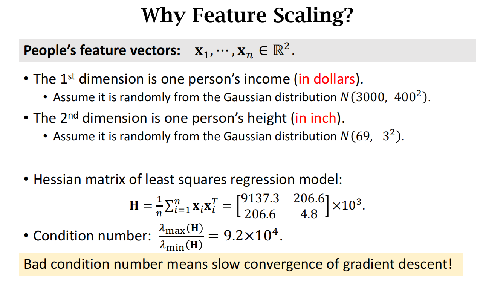
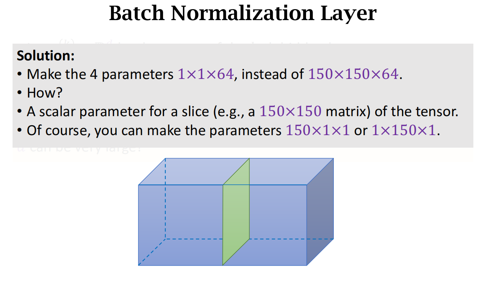

## 基础CNN

## 训练技巧

1. Dropout 正则化 (其他神经元需要弥补)
2. 数据增强
3. 预训练
4. 集成方法
5. 多任务学习
6. 批标准化
7. 梯度注入（Google Inception Net）
8. 跳跃连接（ResNet）

## 归一化

### 需要归一化的原因

Hessian 矩阵为损失函数的二阶导数, 可以用来评估梯度下降

特征值 和 特征向量 表示二阶导数的方向和程度

最大特征/最小特征 = condition number

表示 最大梯度/最小梯度 可以用来评估梯度下降是否合理

如果过大, 则表示 梯度下降的低拟合速度 甚至有可能不拟合

因此, 需要归一化

### 归一化 batch

采用 2 维进行归一化, 减少参数量 和 计算量
