# 召回

## ItemCF 召回通道

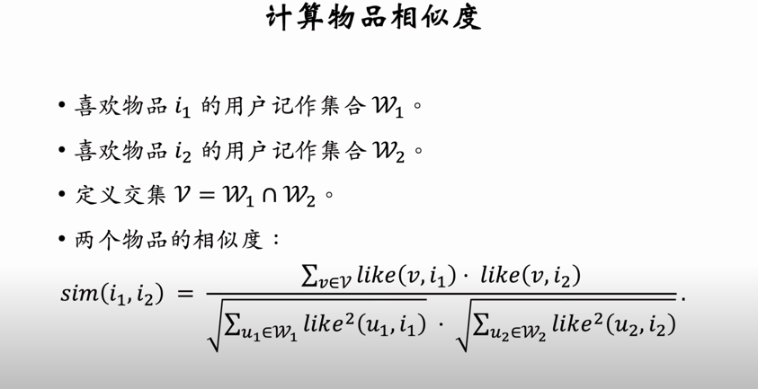

用户 -> 物品列表: 最近交互的n个物品

物品 -> 物品列表: 相似度最高的k个物品

n*k -> top100

## Swing 召回通道(Item变体)

唯一的区别在于计算物品相似度的方式不同。

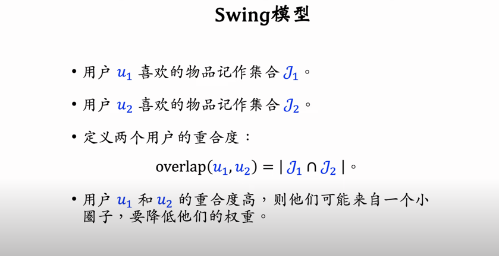

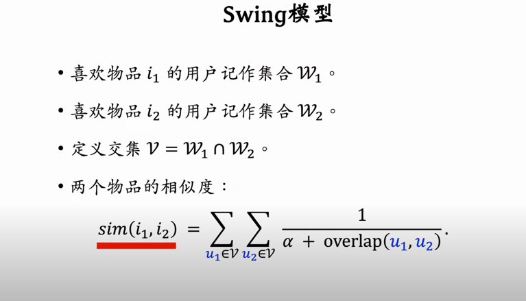

## UserCF

用户相似度

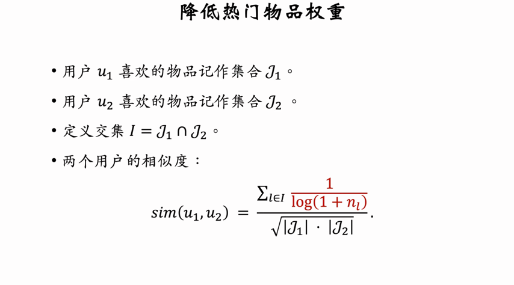

## 双塔模型

### Pointwise

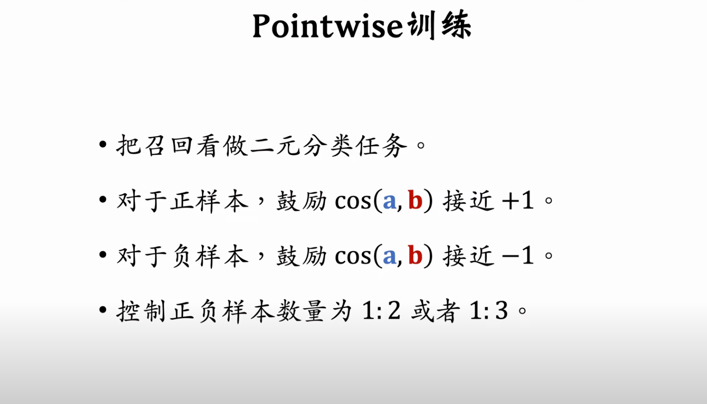

### Pairwise

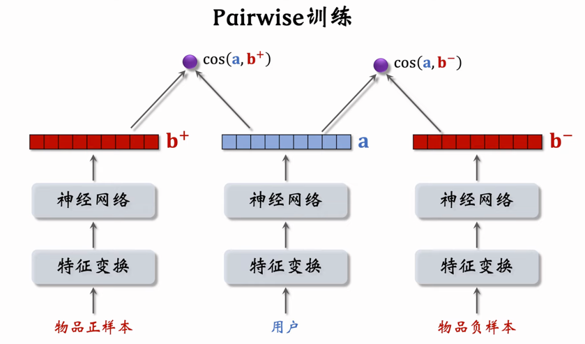

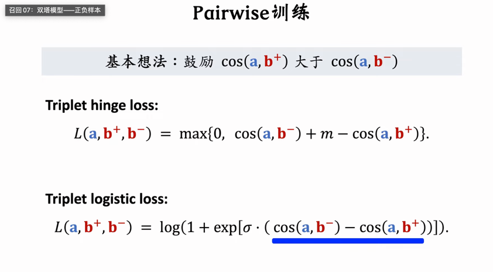

### Listwise

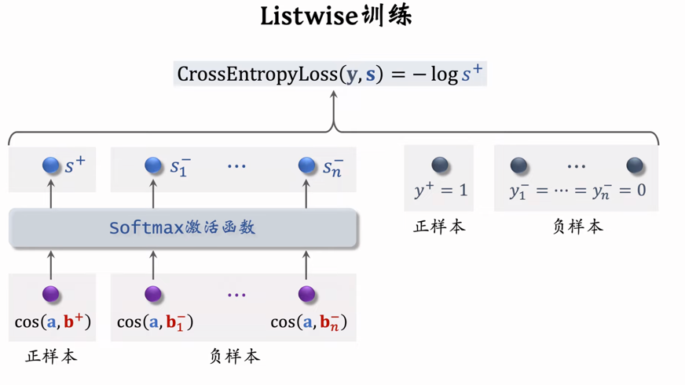

## 正负样本选择

正样本 -> 点进去的样本

### 负样本

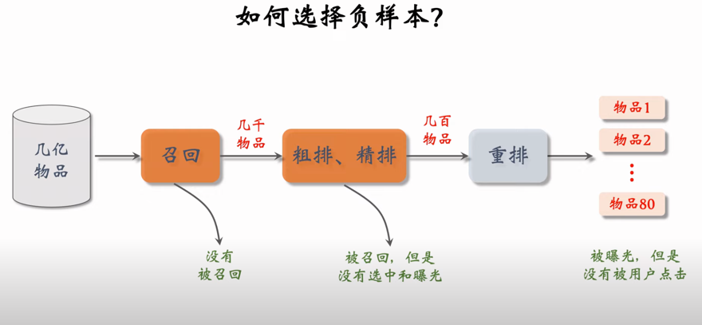

#### 简单负样本 -> 全体物品 百分之50
     
单抽负样本 ( 抽样概率 = 点击次数(0.75)次方 )

batch内 负样本 

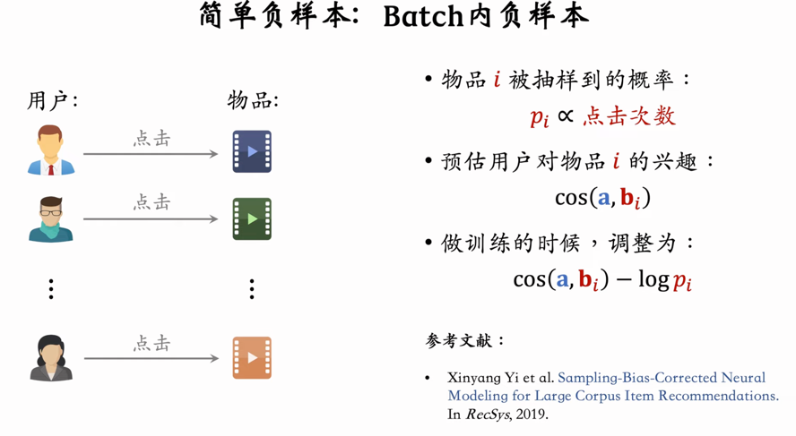

#### 困难负样本 百分之50

被粗排淘汰的样本

精排分数靠后的样本

未点击的可以作为排序模型训练，但是不能作为召回模型的训练

## 线上召回

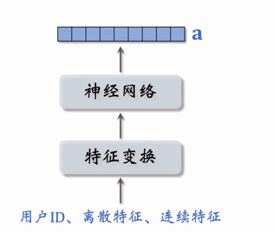

线上用神经网络计算用户向量

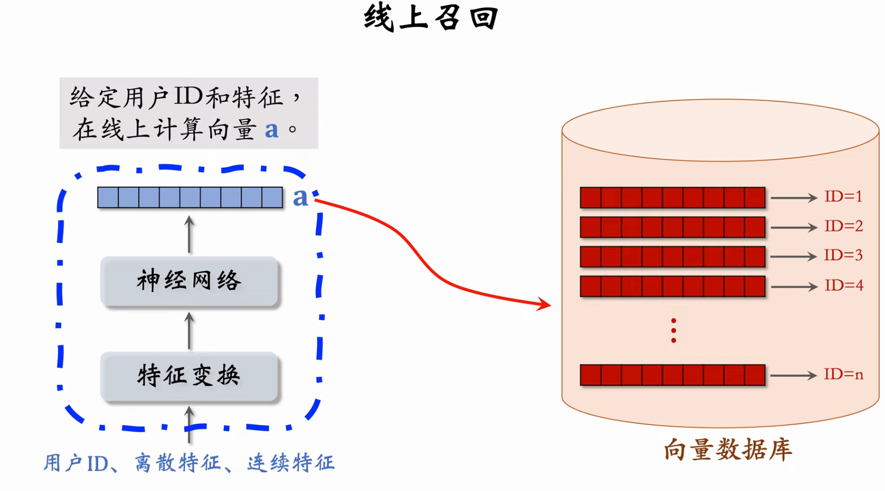

userCF + ItemCF + Swing + 这个，作为召回通道

## 模型更新

### 全量更新

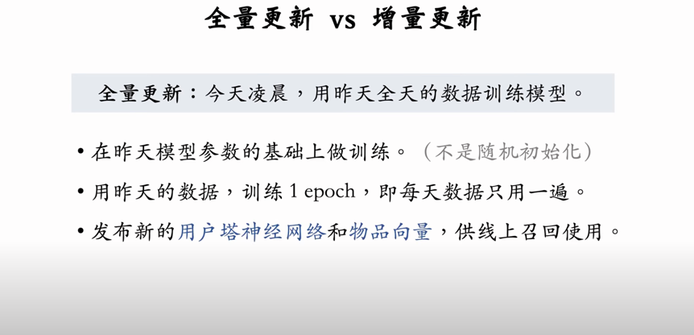

数据库会重新建立索引

### 增量更新

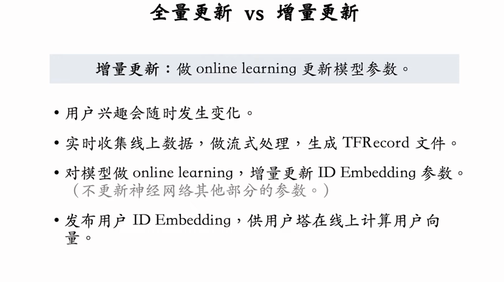

只更新 user 的 embedding

### 全量 + 增量

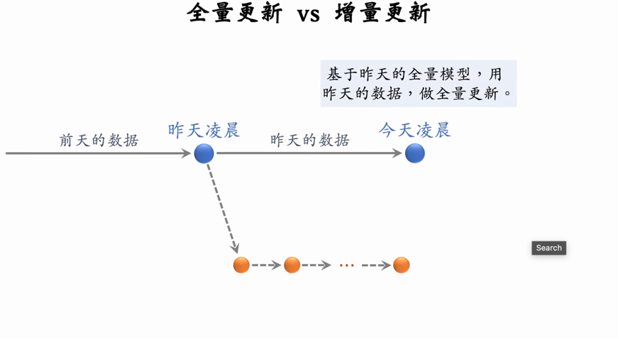

不能只做增量，可能会收到时间顺序的影响，不如直接全部打乱

## 自监督学习

自监督学习用于训练物品塔 

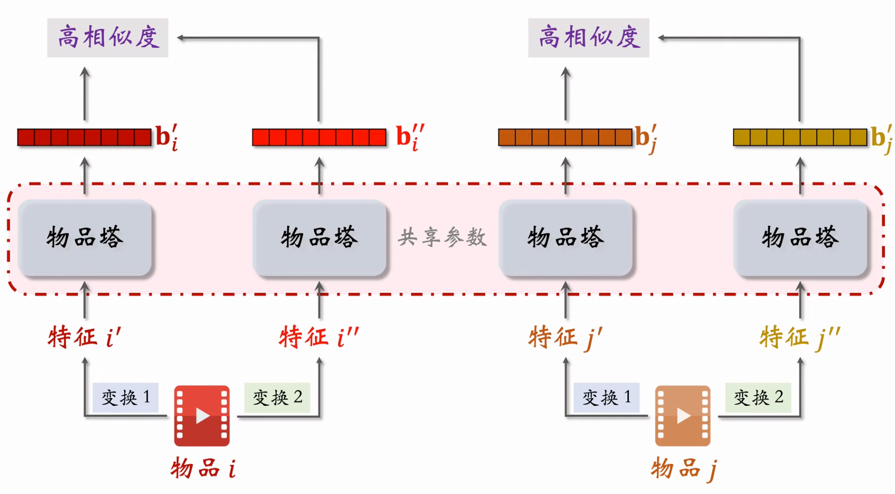

### 损失函数

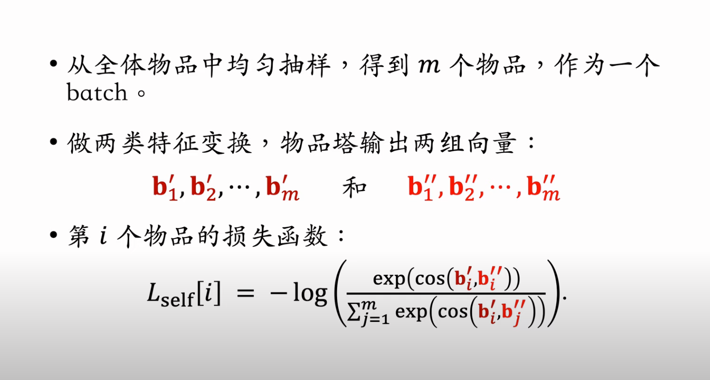

### 三种特征变换的方法

1: 随机 mask 特征，随机丢掉一个类目的所有内容

2: 随机丢掉一个类目的百分之50的特征

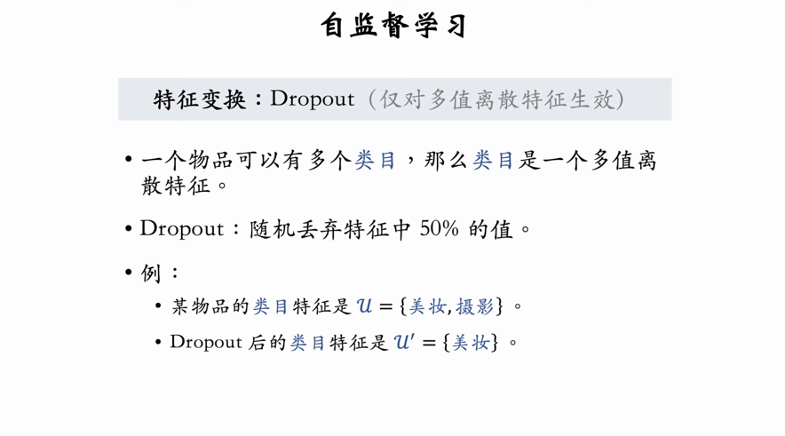

3: 互补特征

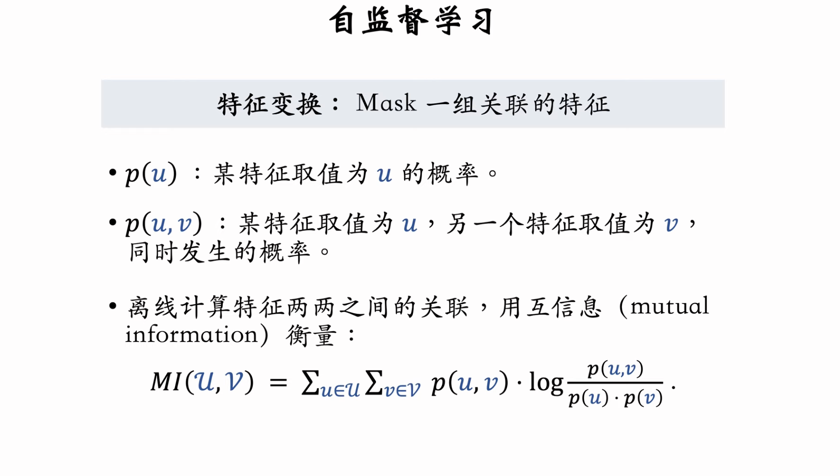

选取互补值最高的一半，进行mask

## Deep Retrival todo

## 其他召回通道

### 地理位置召回

GeoHash -> 优质笔记列表（按时间排序，只考虑优质笔记）

每个GeoHash表示地图上一个长方形的区域

### 同城召回

用城市作为索引

### 作者召回

关注的作者的笔记

### 有交互的作者召回

最近交互的作者的笔记

### 相似作者召回

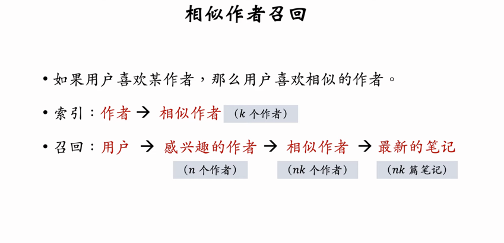

### 缓存召回

精排后由于多样性抽样而未曝光的笔记，加入召回（例如 前50）

#### 退场机制

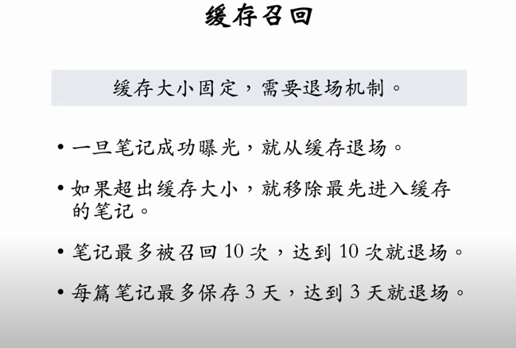

### 曝光过滤

使用 bloom filter
  
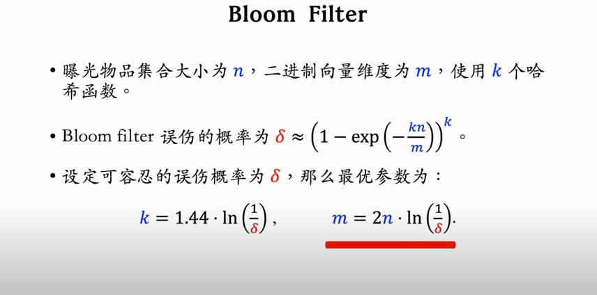

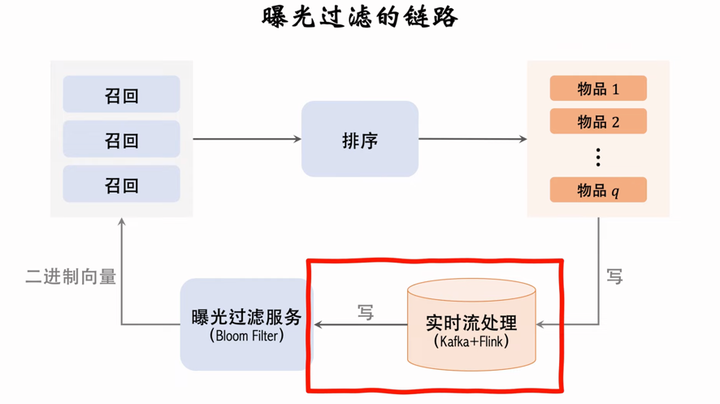

速度要快，否则可能出问题

缺点：不支持删除内容