# UGC 用户上传物品的冷启动

## 特殊处理新笔记原因

1. 缺少与用户交互
3. 增强作者发布意愿

## 冷启动目标

1. 精准推荐
2. 激励发布
3. 挖掘高潜

## 评价指标

1. 作者侧

   1. 发布深透率：发布渗透率 = 当日发布人数 / 日活人数
   2. 人均发布量：人均发布量 = 当日发布笔记 / 日活人数

2. 用户侧指标

   1. 新笔记指标 ：新笔记点击率，交互率（分别考察高曝光/低曝光）
   2. 大盘指标 ：消费时常，日活，月活（冷启动并不是为了促进消费指标，但是也不能显著伤害）

3. 内容侧指标
   1. 高热笔记占比

作者侧和用户侧基本上都有，内容侧少数厂有用

大力扶持低曝光，作者侧变好，用户侧变差

## 冷启动的优化点

1. 优化全链路（包括召回和排序）
2. 流量调控（流量怎么在新笔记和老笔记中分配）

## 召回的依据
1. 图片，文字，地点
2. 算法或者人工标注的标签
3. 没有用户点击，点赞等信息
4. 没有笔记 ID embedding

## 冷启动带来的困难

没有 ID embedding，导致 双塔模型 和 排序模型 都不适用
缺少用户信息，导致 ItemCF 做不好

## 召回通道

1. ~~ItemCF 召回通道~~
2. 双塔模型，改造后适用
3. 类目，关键词适用
4. 聚类召回通道
5. Look-Alike 召回

## 改进双塔模型

### 改进 embedding

方案1：新笔记使用 default embedding，下次模型训练的时候，再修改
方案2：利用相似笔记 embedding 向量（查找 topK 内容最相似的高曝光笔记，取平均）

### 改进召回通道

使用多个召回池
* 1小时新笔记
* 6小时新笔记
* 24小时新笔记
* 30天笔记

共享一个双塔模型，不会增加训练的代价

## 类目召回

1. 记录用户感兴趣的 类目 和 关键词
2. 系统维护类目 -> 笔记ID，按照发布时间倒排
3. 用户画像 -> 类目 -> 笔记列表 取回每个类目的前 k 篇

## 关键词召回
与类目召回一致

缺点：
1. 只对刚刚发布的新笔记有效（topK找不到它）
2. 弱个性化，不够精准，例如 喜欢鱼，为动物，但是可能只给狗

## 聚类召回

1. 事先训练神经网络,基于图文内容和类目,把笔记映射到向量
2. 把笔记做聚类(k-means),划分为 1000 cluster,记录每个cluster的中心方向
3. 笔记发布后,神经网络得到向量,找到最类似的 cluster
4. 在这个聚类中,按照时间倒排

线上召回

1. 找到 last-n 交互的笔记列表
2. 找到最相似的 cluster
3. 每个 cluster 召回 m 篇,得到 mn 篇笔记

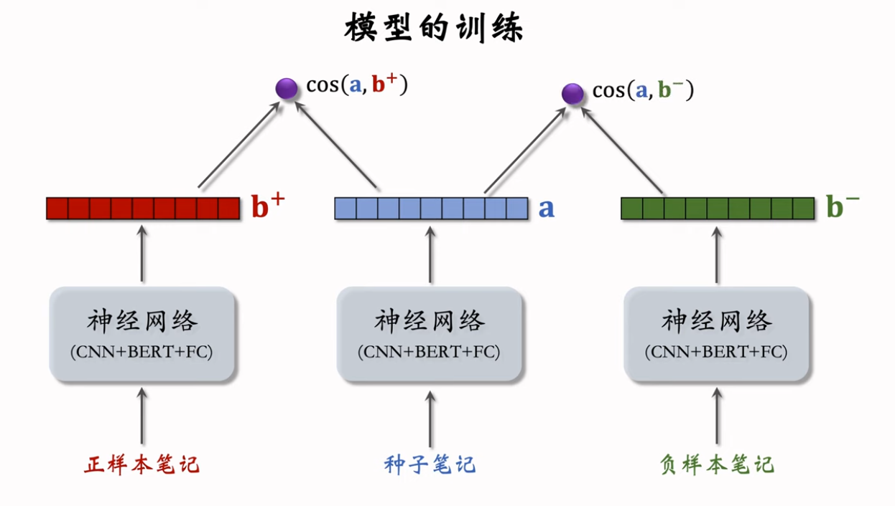

训练类似于重排中的多样化,但是不能用clip,避免过于同质化

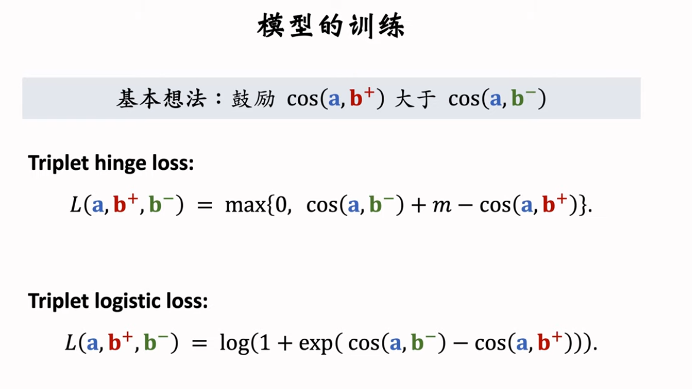

### 正样本:

方法1: 人工标注

方法2: 算法自动选择正样本
1. 只用高曝光笔记作为二元组
2. 两片笔记有相同的二级类目
3. 最后使用 ItemCF

### 负样本:

1. 字数多
2. 笔记质量高

## Look-Alike 人群扩散

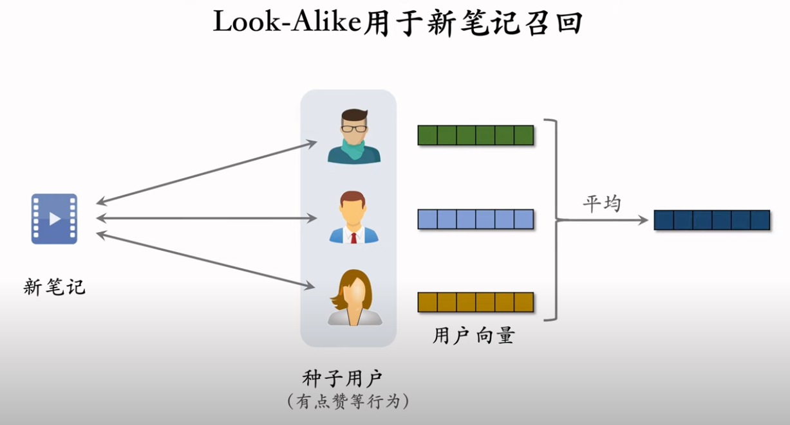

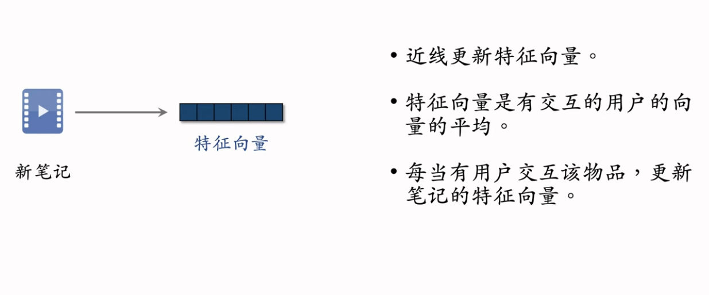

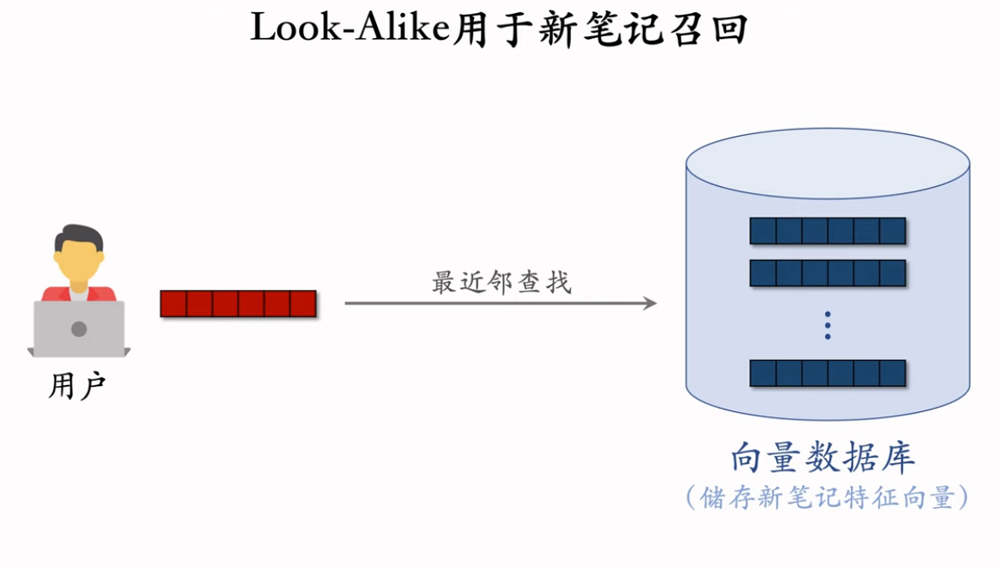

## 流量调控

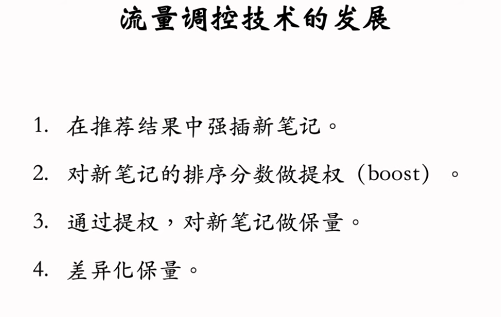

### 新笔记提权

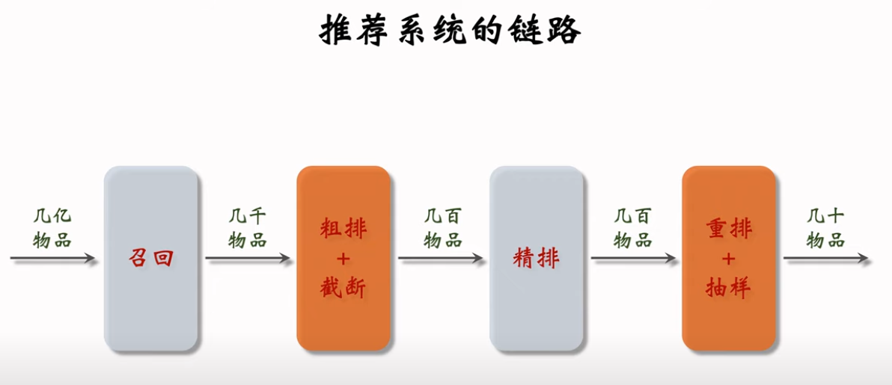

在粗排和重排中提权,提高其过漏斗的概率

优点: 容易实现
缺点: 曝光量敏感,且难以控制

### 新笔记保量

#### 静态的简单保量

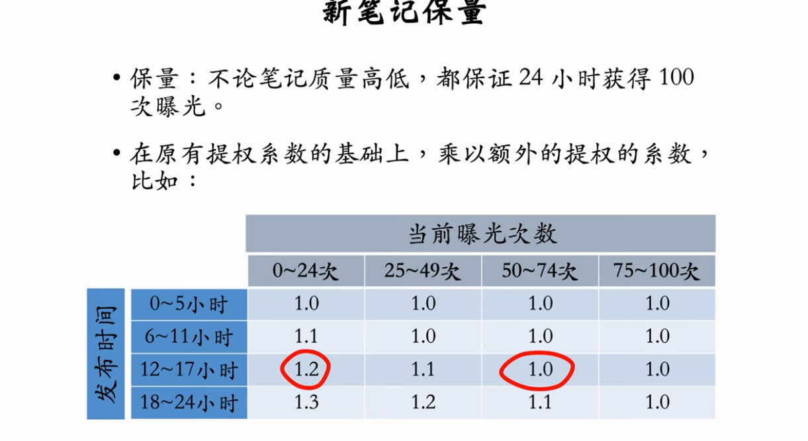

#### 动态保量

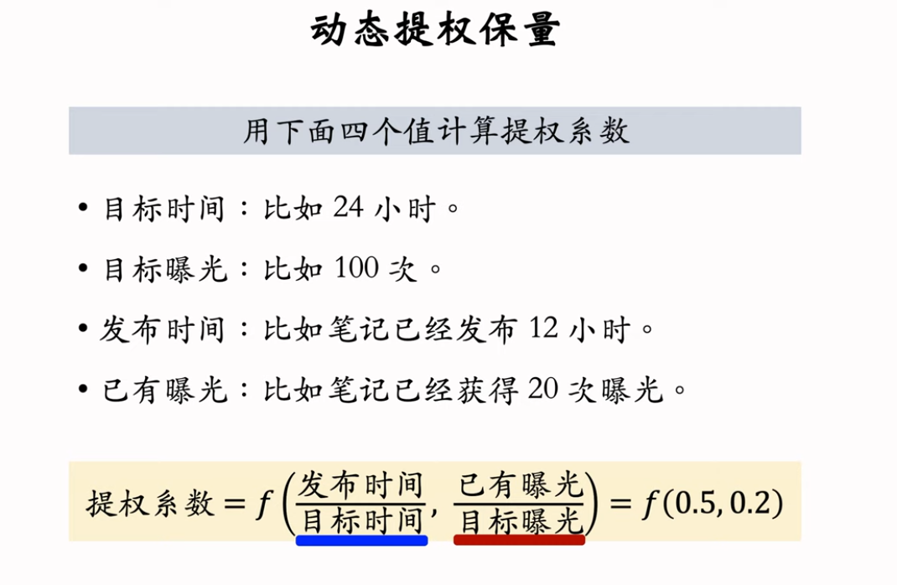

#### 保量难点

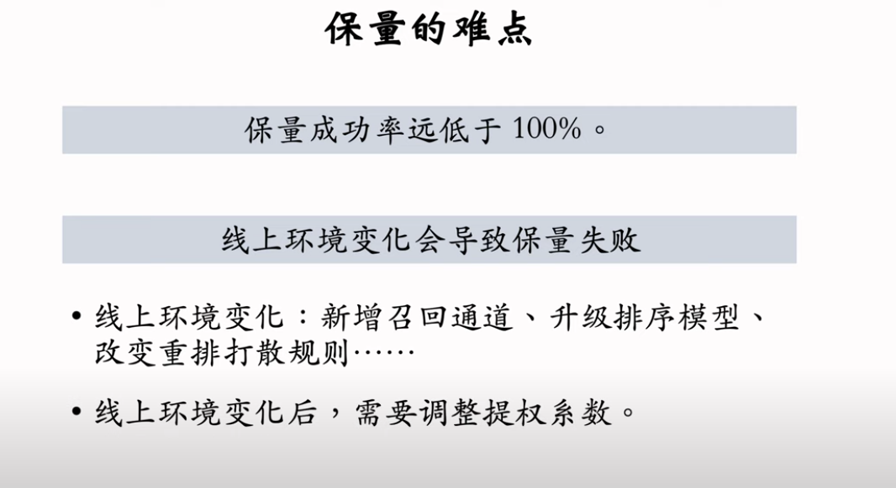

#### 差异化保量

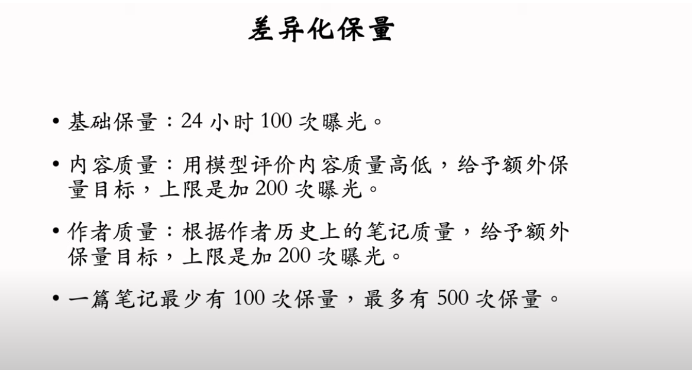

达到数量后停止提权,公平竞争

## 冷启动的AB测试

todo