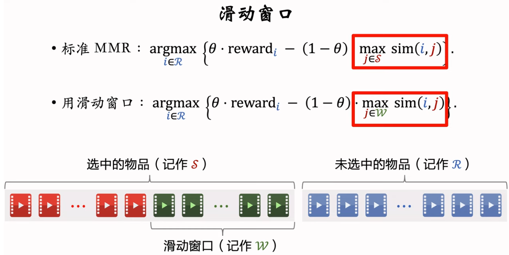

# 重排

## 多样性

### 转化为 向量特征

可以通过CNN和BERT训练进行图片和文字embedding, 再进行多样化处理

更好的方法是使用clip, 进行图文匹配训练, 再多样化处理

例如拼接和相乘, 再进行相似度计算

### 基于多样性选取样本

#### MMR 多样性算法

使用滑动窗口 + 规则约束

#### DPP 多样性算法

使用行列式表示多样性

使用贪心算法

使用hulu算法, 减少计算量, 并且加上滑动窗口, 也可加上规则约束

